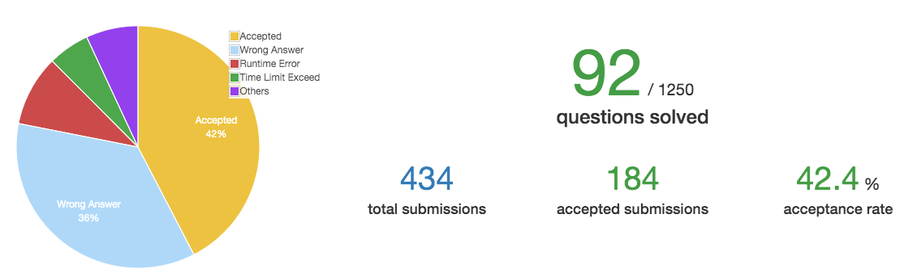

# Week 1 

时间：2019-10-28 ~ 2019-11-03   
完成情况：1,2,3,4,6,7,8,9    
进度：如下图    

 

# List  

| 题号 | 笔记 |  
|---|---|  
| 1 | [Two Sum ](https://github.com/chenxinlong/leetcode/blob/master/algs/1.go) |  
| 2 | [Add Two Numbers](https://github.com/chenxinlong/leetcode/blob/master/algs/2.go)|  
| 3 | [Longest Substring Without Repeating Characters](https://github.com/chenxinlong/leetcode/blob/master/algs/3.go)|  
| 4 | [Median of Two Sorted Arrays](https://github.com/chenxinlong/leetcode/blob/master/algs/4.go)|  
| 6 | [ZigZag Conversion](https://github.com/chenxinlong/leetcode/blob/master/algs/6.go)|  
| 7 | [Reverse Integer](https://github.com/chenxinlong/leetcode/blob/master/algs/7.go)|  
| 8 | [String to Integer (atoi)](https://github.com/chenxinlong/leetcode/blob/master/algs/8.go)|  
| 9 | [Palindrome Number](https://github.com/chenxinlong/leetcode/blob/master/algs/9.go)|  