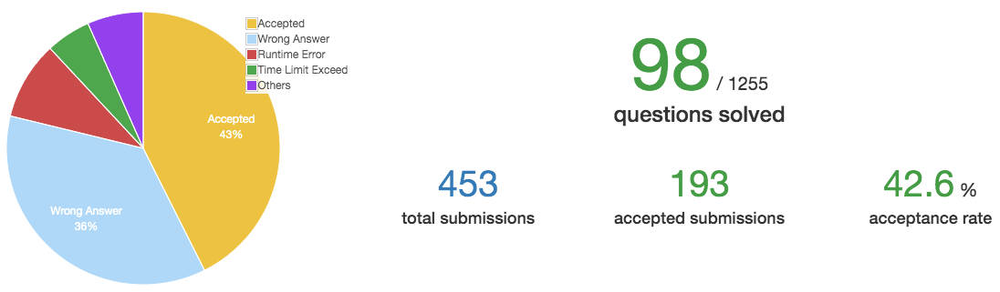

# Week 2

时间：2019-11-04 ~ 2019-11-10  
完成情况：11,12,13,14,19,20    
进度：如下图    

 

# List  

| 题号 | 笔记 |  
|---|---|  
| 11 | [Container With Most Water](https://github.com/chenxinlong/leetcode/blob/master/algs/11.go) |  
| 12 | [Integer to Roman](https://github.com/chenxinlong/leetcode/blob/master/algs/12.go)|  
| 13 | [Roman to Integer](https://github.com/chenxinlong/leetcode/blob/master/algs/13.go)|  
| 14 | [Longest Common Prefix](https://github.com/chenxinlong/leetcode/blob/master/algs/14.go)|  
| 19 | [Remove Nth Node From End of List ](https://github.com/chenxinlong/leetcode/blob/master/algs/19.go)|  
| 20 | [Valid Parentheses](https://github.com/chenxinlong/leetcode/blob/master/algs/20.go)|  