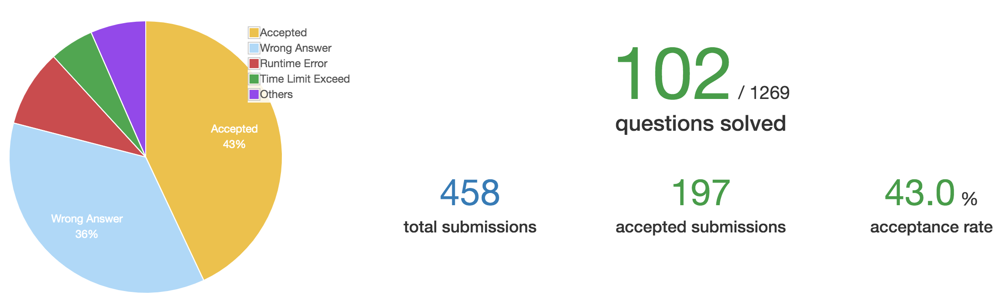

# Week 4

时间：2019-11-18 ~ 2019-11-24 
完成情况：5,27
进度：如下图    

 

# List  

| 题号 | 笔记 |  
|---|---|  
| 5 | [Longest Palindromic Substring](https://github.com/chenxinlong/leetcode/blob/master/algs/5.go) |  
| 27 | [Remove Element](https://github.com/chenxinlong/leetcode/blob/master/algs/27.go)|  