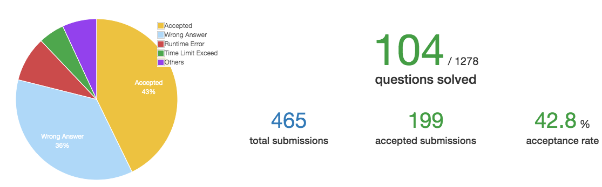

# Week 5

时间：2019-11-25 ~ 2019-12-01  
完成情况：76,239 
进度：如下图    

 

# List  

| 题号 | 笔记 |  
|---|---|  
| 76 | [Minimum Window Substring](https://github.com/chenxinlong/leetcode/blob/master/algs/76.go) |  
| 239 | [Sliding Window Maximum](https://github.com/chenxinlong/leetcode/blob/master/algs/239.go)|  