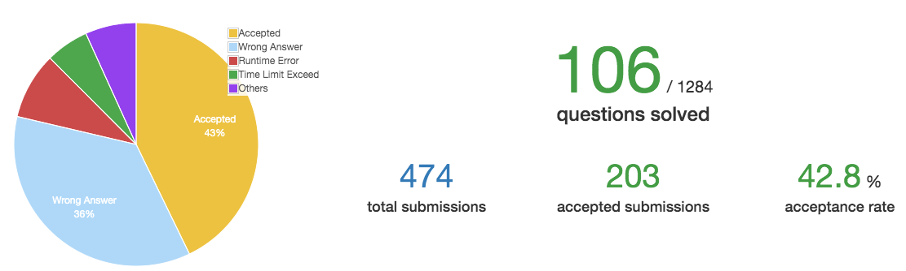

# Week 6

时间：2019-12-01 ~ 2019-12-08
完成情况：38, 53     
进度：如下图    

 

# List  

| 题号 | 笔记 |  
|---|---|  
| 38 | [Count and Say](https://github.com/chenxinlong/leetcode/blob/master/algs/38.go)  
| 53 | [Maximum Subarray](https://github.com/chenxinlong/leetcode/blob/master/algs/53.go)