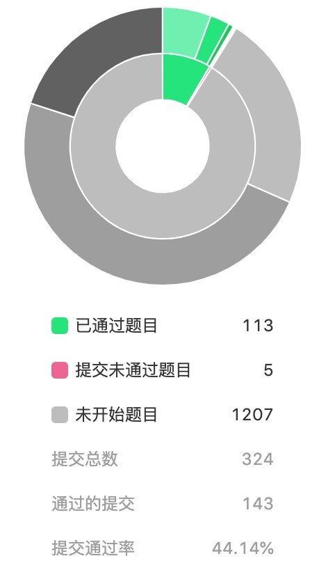

# LeetCode 之旅

## 题解

- [**3、无重复字符的最长子串**](https://github.com/hubvue/algorithms/issues/32)
- [**5、最长回文子串**](https://github.com/hubvue/algorithms/issues/33)
- [**6、Z 字形变换**](https://github.com/hubvue/algorithms/issues/34)
- [**11、盛最多水的容器**](https://github.com/hubvue/algorithms/issues/35)
- [**12、整数转罗马数字**](https://github.com/hubvue/algorithms/issues/36)
- [**15. 三数之和**](https://github.com/hubvue/algorithms/issues/37)
- [**16、最接近的三数之和**](https://github.com/hubvue/algorithms/issues/38)
- [**17、电话号码的字母组合**](https://github.com/hubvue/algorithms/issues/39)
- [**18、四数之和**](https://github.com/hubvue/algorithms/issues/40)
- [**19、删除链表的倒数第 N 个节点**](https://github.com/hubvue/algorithms/issues/41)
- [**20、有效的括号**](https://github.com/hubvue/algorithms/issues/42)
- [**21、合并两个有序链表**](https://github.com/hubvue/algorithms/issues/43)
- [**22、括号生成**](https://github.com/hubvue/algorithms/issues/44)
- [**23、合并 K 个排序链表**](https://github.com/hubvue/algorithms/issues/45)
- [**24、两两交换链表中的节点**](https://github.com/hubvue/algorithms/issues/46)
- [**25、K 个一组翻转链表**](https://github.com/hubvue/algorithms/issues/47)
- [**26、删除排序数组中的重复项**](https://github.com/hubvue/algorithms/issues/48)
- [**27、移除元素**](https://github.com/hubvue/algorithms/issues/49)
- [**28、实现 strStr()**](https://github.com/hubvue/algorithms/issues/50)
- [**29、两数相除**](https://github.com/hubvue/algorithms/issues/51)

## 进度统计

### 刷题进度

- 第一周进度: 5 题 截止时间: 2019-11-03 难度: 0 简 5 中 0 难

  - 5、最长回文子串
  - 6、Z 字形变换
  - 11、盛最多水的容器
  - 12、整数转罗马数字
  - 16、最接近的三数之和

- 第二周进度: 3 题 截止时间: 2019-11-10 难度: 0 简 3 中 0 难

  - 17、电话号码的字母组合
  - 18、四数之和
  - 19、删除链表的倒数第 N 个节点

- 第三周进度: 3 题 截止时间: 2019-11-17 难度: 1 简 2 中 0 难

  - 24、两两交换链表中的节点
  - 31、下一个排列
  - 217、存在重复元素

- 第四周进度: 3 题 截止时间: 2019-11-24 难度: 3 简 0 中 0 难

  - 237、删除链表中的节点
  - 257、二叉树的所有路径
  - 258、各位相加

* 第五周进度: 3 题 截止时间: 2019-12-01 难度: 0 简 1 中 2 难

  - 4、寻找两个有序数组的中位数
  - 25、K 个一组翻转链表
  - 29、两数相除

- 第六周进度: 3 题 截止时间: 2019-12-08 难度: 3 简 0 中 0 难

  - 204、计数质数
  - 226、翻转二叉树
  - 671、二叉树中第二小的节点

- 第七周进度: 2 题 截止时间: 2019-12-15 难度: 2 简 0 中 0 难

  - 263、丑数
  - 268、缺失数字

* 第八周进度: 2 题 截止时间: 2019-12-22 难度: 2 简 0 中 0 难

  - 283、移动零
  - 290、单词规律

* 第九周进度: 2 题 截止时间: 2019-12-29 难度: 2 简 0 中 0 难

  - 292、Nim 游戏
  - 344、反转字符串

* 第十周进度: 2 题 截止时间: 2020-01-05 难度: 2 简 0 中 0 难

  - 345、反转字符串中的元音字母
  - 349、两个数组的交集

- 总刷题数：113 / 1247

### 笔记进度

- 第一周进度：2 题 截止时间：2019-11-03

  - 3、无重复字符的最长子串
  - 5、最长回文子串

- 第二周进度：2 题 截止时间：2019-11-10

  - 6、Z 字形变换
  - 11、盛最多水的容器

- 第三周进度：1 题 截止时间：2019-11-17

  - 12、整数转罗马字符

- 第四周进度：1 题 截止时间：2019-11-24

  - 15、三数之和

- 第五周进度：4 题 截止时间：2019-12-01

  - 16、最接近的三数之和
  - 17、电话号码的字母组合
  - 18、四数之和
  - 19、删除链表的倒数第 N 个节点

- 第六周进度：2 题 截止时间：2019-12-08

  - 20、有效的括号
  - 21、合并两个有序链表

- 第七周进度：2 题 截止时间：2019-12-15

  - 22、括号生成
  - 23、合并 K 个排序链表

- 第八周进度：2 题 截止时间：2019-12-22

  - 24、两两交换链表中的节点
  - 25、K 个一组翻转链表

- 第九周进度：2 题 截止时间：2019-12-29

  - 26、删除排序数组中的重复项
  - 27、移除元素

- 第十周进度：2 题 截止时间：2020-01-03

  - 28、实现 strStr()
  - 29、两数相除

### 进展图

