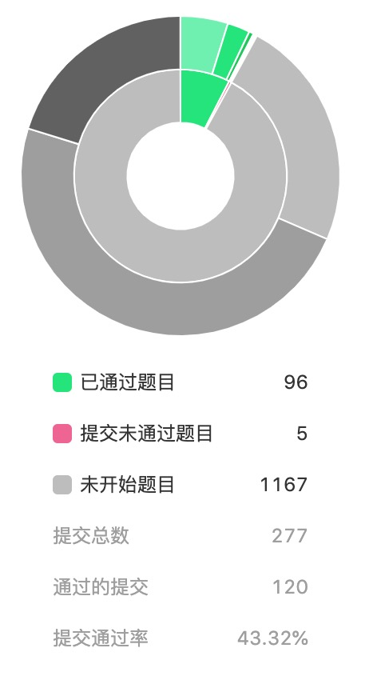

# LeetCode 之旅

## 题解

- [**3、无重复字符的最长子串**](https://github.com/hubvue/algorithms/issues/32)
- [**5、最长回文子串**](https://github.com/hubvue/algorithms/issues/33)
- [**6、Z 字形变换**](https://github.com/hubvue/algorithms/issues/34)
- [**11、盛最多水的容器**](https://github.com/hubvue/algorithms/issues/35)
- [**12、整数转罗马数字**](https://github.com/hubvue/algorithms/issues/36)

## 进度统计

### 刷题进度

- 第一周进度: 5 题 截止时间: 2019-11-03 难度: 0 简 5 中 0 难

  - 5、最长回文子串
  - 6、Z 字形变换
  - 11、盛最多水的容器
  - 12、整数转罗马数字
  - 16、最接近的三数之和

- 第二周进度: 3 题 截止时间: 2019-11-10 难度: 0 简 3 中 0 难

  - 17、电话号码的字母组合
  - 18、四数之和
  - 19、删除链表的倒数第 N 个节点

- 第三周进度: 2 题 截止时间: 2019-11-17 难度: 1 简 2 中 0 难

  - 24、两两交换链表中的节点
  - 31、下一个排列
  - 217、存在重复元素

* 总刷题数：96 / 1247

### 笔记进度

- 第一周进度：2 题 截止时间：2019-11-03

  - 3、无重复字符的最长子串
  - 5、最长回文子串

- 第二周进度：2 题 截止时间：2019-11-10

  - 6、Z 字形变换
  - 11、盛最多水的容器

- 第三周进度：1 题 截止时间：2019-11-17

  - 6、整数转罗马字符

### 进展图

