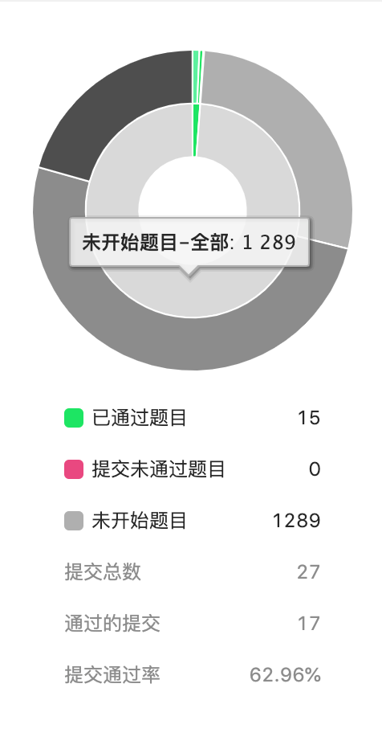

#### 🏠刷题合集

## 进度统计

##### 第一周（2019.10.28 - 2019.11.03）题数：3 | 笔记：3
1. [两数之和](https://github.com/Vstar18/FE-knowledge-algorithm/issues/1)
2. [两数相加](https://github.com/Vstar18/FE-knowledge-algorithm/issues/2)(这个有点难，先过了，蓝过)
3. [无重复字符的最长子串](https://github.com/Vstar18/FE-knowledge-algorithm/issues/3)
4. [寻找两个有序数组的中位数](https://github.com/Vstar18/FE-knowledge-algorithm/issues/4)

##### 第二周（2019.11.04 - 2019.11.10）题数：2 | 笔记：2

1. [整数反转](https://github.com/Vstar18/FE-knowledge-algorithm/issues/5)
2. [字符串转换整数](https://github.com/Vstar18/FE-knowledge-algorithm/issues/6)

##### 第三周（2019.11.11 - 2019.11.17）题数：2 | 笔记：2

1. [回文数--动态规划](https://github.com/Vstar18/FE-knowledge-algorithm/issues/7)
2. [盛最多水的容器--双指针](https://github.com/Vstar18/FE-knowledge-algorithm/issues/9)

##### 第四周（2019.11.18 - 2019.11.24）题数：2 | 笔记：2

1. [罗马数字转整数](https://github.com/Vstar18/FE-knowledge-algorithm/issues/11)
2. [最长公共前缀](https://github.com/Vstar18/FE-knowledge-algorithm/issues/12)

#### 第五周（2019.11.25-2019.12.01）题数：2 | 笔记：2

1. [三数之和](https://github.com/Vstar18/FE-knowledge-algorithm/issues/13)
2. [最接近的三数之和](https://github.com/Vstar18/FE-knowledge-algorithm/issues/14)

#### 第六周（2019.12.02-2019.12.08）题数：2 | 笔记：2

1. [有效的括号](https://github.com/Vstar18/FE-knowledge-algorithm/issues/15)
2. [合并两个有序链表](https://github.com/Vstar18/FE-knowledge-algorithm/issues/16)

#### 第七周（2019.12.08-2019.12.15）题数：2 | 笔记：2

1. [移除元素](https://github.com/Vstar18/FE-knowledge-algorithm/issues/17)
2. [实现strStr()](https://github.com/Vstar18/FE-knowledge-algorithm/issues/18)
