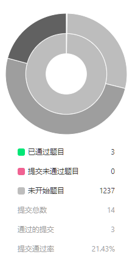

# LeetCode 之旅

观看以下题解建议 ```ctrl/command + 点击``` 或 ```右击在新窗口打开```;

## 题解
- [**1.两数之和**](https://xiaoranzife.com/guide/arithmetic/1.TwoSum.html) 空间换时间
- [**2.两数相加**](https://xiaoranzife.com/guide/arithmetic/2.AddTwoNumbers.html) 双指针，堆栈空间法
- [**3.无重复字符的最长子串**](https://xiaoranzife.com/guide/arithmetic/3.lengthOfLongestSubstring.html) 滑动窗口

## 进度统计


- 第一周进度: 3题 截止时间: 20191027 难度: 1简 2中 0难
