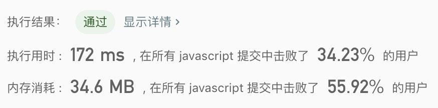
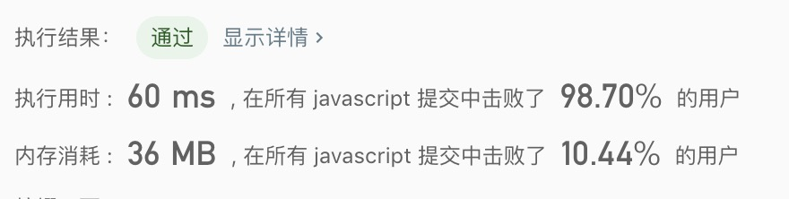

## 两数之和

> 题目描述，题目描述，题目描述，题目描述，题目描述，题目描述，题目描述，题目描述，题目描述。

给定一个整数数组 `nums` 和一个目标值 `target`，请你在该数组中找出和为目标值的那 两个 整数，并返回他们的数组下标。<br>
你可以假设每种输入只会对应一个答案。但是，你不能重复利用这个数组中同样的元素。

示例:
```text
给定 nums = [2, 7, 11, 15], target = 9

因为 nums[0] + nums[1] = 2 + 7 = 9
所以返回 [0, 1]
```

- 解法1
  - 解题思路：使用暴力破解
    
  - 代码
    ```javascript
    /**
     * @param {number[]} nums
     * @param {number} target
     * @return {number[]}
     */
    const twoSum = function(nums, target) {    
      for(let i = 0; i < nums.length; i++){
        for(let j = 0; j < nums.length; j++){
          if(nums[i] + nums[j] === target && i !== j){
            return [i, j];
          }
        }
      }
    };
    ```
  - 测试结果
  
  
  - 算法分析
    - 时间复杂度: `O(n^2)`
    - 空间复杂度: `O(1)`
    - 逻辑复杂度: 简单

- 解法2
  - 解题思路：
    1. 使用`store`临时储存匹配不到值，
    2. 通过`for`遍历数组，匹配被查找值`target - item`是否存在于`store`中，
    3. 有则返回结果，没有的话，添加当前值`item`到`store`中
    
  - 代码
    ```javascript
    /**
     * @param {number[]} nums
     * @param {number} target
     * @return {number[]}
     */
    const twoSum = function(nums, target) {
      const store = {};
      let result = [];
      let pre = null;
      nums.forEach((item, i) => {
        pre = store[target - item];
        if(typeof pre !== 'undefined'){
          result.push(pre, i);
          return false;
        }
        store[item] = i;
      });
      return result;
    };
    ```
    
   - 测试结果
    
    
  - 算法分析
    - 时间复杂度: `O(n)`
    - 空间复杂度: `O(n)`
    - 逻辑复杂度: 中等

- 总结
  > 解法2刚开始没思路，大概知道用对象去存储数据，但是不知道具体怎么操作，看到其他的文章才知道的。<br>
  > 知其所以，不知其然。