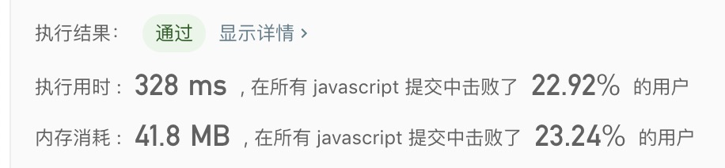
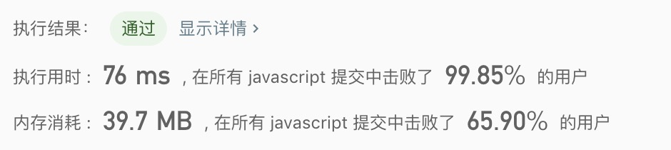

## 无重复字符的最长子串

> 给定一个字符串，请你找出其中不含有重复字符的最长子串的长度。

示例1:
```text
输入: "abcabcbb"
输出: 3 
解释: 因为无重复字符的最长子串是 "abc"，所以其长度为 3。
```

示例2:
```text
输入: "bbbbb"
输出: 1
解释: 因为无重复字符的最长子串是 "b"，所以其长度为 1。
```

示例2:
```text
输入: "bbbbb"
输出: 1
解释: 因为无重复字符的最长子串是 "b"，所以其长度为 1。
```

示例3:
```text
输入: "pwwkew"
输出: 3
解释: 因为无重复字符的最长子串是 "wke"，所以其长度为 3。
     请注意，你的答案必须是 子串 的长度，"pwke" 是一个子序列，不是子串。
```

- 解法1
  - 解题思路：使用暴力破解
    1. 暴力查找无重复的字符串，直到找到重复的，否则计数，并记录字符串
    2. 记录下个数，并且跟之前的找到的个数进行对比  
    
  - 代码
    ```javascript
    /**
     * @param {string} s
     * @return {number}
     */
    var lengthOfLongestSubstring = function(s) {
      let max = 0, count = 1, temp = '';
      for(let i = 0; i < s.length; i++){
        temp = s[i];
        max = count > max ? count : max;
        count = 1;
        for(let j = i + 1; j < s.length; j++){
          if(temp.includes(s[j])){
            break;
          }
          count++;
          temp += s[j];
        }
      }
      return max;
    };
    ```
  - 测试结果
  
  
  - 算法分析
    - 时间复杂度: `O(n^2)`
    - 空间复杂度: `O(1)`
    - 逻辑复杂度: 简单

- 解法2
  - 解题思路：滑动算法
    1. 通过指针移动数组，把不重复的值添加到子数组中
    2. 如果遇到改值存在于子数组组，删除数组的前一个值，在添加改值
    3. 比较每一个子数组的长度，记录最大的子数组
    
  - 代码
    ```javascript
    /**
     * @param {string} s
     * @return {number}
     */
    const lengthOfLongestSubstring = function(s) {
      let max = 0, str = '';
      
      for(let i = 0; i < s.length; i++){
        let value = s[i];
        let index = str.indexOf(value);
          if(index > -1){
            str = str.slice(index + 1);
          }
        str += value;
        max = str.length > max ? str.length : max;
      } 
      return max;
    };
    ```
    
   - 测试结果
    
    
  - 算法分析
    - 时间复杂度: `O(n)`
    - 空间复杂度: `O(1)`

- 总结
  > 滑动算法没接触过不了解，但是知道原理后就变得很简单。而且性能很强