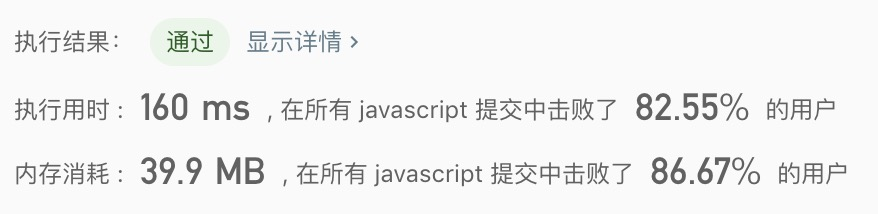

## 整数转罗马数字

> 罗马数字包含以下七种字符： I， V， X， L，C，D 和 M。  <br/>
> 例如，罗马数字 2 写做 II ，即为两个并列的 1。12 写做 XII ，即为 X + II 。 <br/>
> 27 写做  XXVII, 即为 XX + V + II 。  <br/>
> 通常情况下，罗马数字中小的数字在大的数字的右边。  <br/>
> 但也存在特例，例如 4 不写做 IIII，而是 IV。数字 1 在数字 5 的左边，所表示的数等于大数 5 减小数 1 得到的数值 4 。同样地，数字 9 表示为 IX。 <br/>
> 这个特殊的规则只适用于以下六种情况： <br/> 
> I 可以放在 V (5) 和 X (10) 的左边，来表示 4 和 9。  <br/>
> X 可以放在 L (50) 和 C (100) 的左边，来表示 40 和 90。  <br/>
> C 可以放在 D (500) 和 M (1000) 的左边，来表示 400 和 900。  <br/>
> 给定一个整数，将其转为罗马数字。输入确保在 1 到 3999 的范围内。 <br/>
```text
  字符          数值
  I             1
  V             5
  X             10
  L             50
  C             100
  D             500
  M             1000
``` 

示例1:
```text
输入: 3
输出: "III"
```

示例2:
```text
输入: 4
输出: "IV"
```

示例3:
```text
输入: 9
输出: "IX"
```

示例4:
```text
输入: 58
输出: "LVIII"
解释: L = 50, V = 5, III = 3.
```

示例5:
```text
输入: 1994
输出: "MCMXCIV"
解释: M = 1000, CM = 900, XC = 90, IV = 4.
```

- 解法1
  - 解题思路:
    1. 通过整数跟罗马数字的映射关系，把特殊的数据一一整理出来。
    2. 个十百千的逻辑转换逻辑一致，所以可以这部分抽离出来
    
  - 代码
    ```javascript
    /**
     * @param {number} num
     * @return {string}
     */
    const intToRoman = function(num) {
      let str = '', times = 0;
      const thousands = num / 1000;
      if(thousands >= 1){
        num = num % 1000;
        times = Math.floor(thousands);
        str += getRoman(times, 'M');
      }
      const hundred = num /100;
      if(hundred >= 1){
        num = num % 100;
        times = Math.floor(hundred);
        str += getRoman(times, 'C', 'D', 'M');
      }
      const ten = num /10;
      if(ten >= 1){
        num = num % 10;
        times = Math.floor(ten);
        str += getRoman(times, 'X', 'L', 'C');
      }
      if(num >= 1){
        times = Math.floor(num);
        str += getRoman(times, 'I', 'V', 'X');
      }
      return str;
    };
    
    const getRoman = function(num = 0, start = '', middle = '', end = ''){
      if(num < 4){
        return start.repeat(num);
      }else if(num === 4){
        return start + middle;
      }else if(num === 5){
        return middle;
      }else if(num > 5 && num < 9){
        return middle + start.repeat(num - 5);
      }else if(num === 9){
        return start + end;
      }
    };
    ```
    
  - 测试结果
  
  
  - 算法分析
    - 时间复杂度: `O(1)`
    - 空间复杂度: `O(1)`