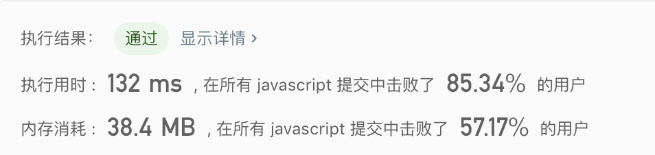

## 两数相加

> 给出两个 非空 的链表用来表示两个非负的整数。<br/>
> 其中，它们各自的位数是按照逆序的方式存储的，并且它们的每个节点只能存储一位数字。<br/>
> 如果，我们将这两个数相加起来，则会返回一个新的链表来表示它们的和。<br/>
> 您可以假设除了数字 0 之外，这两个数都不会以 0 开头。

示例:
```text
输入：(2 -> 4 -> 3) + (5 -> 6 -> 4)
输出：7 -> 0 -> 8
原因：342 + 465 = 807
```

- 解法1
  - 解题思路:
    1. 通过`l1.next, l2.next`遍历并计算链表的每个值，将值保存到`l1`中
    2. 如果值大于`10`，则对`l1.next`进行赋值操作：
      - 如果`l1.next`存在，则直接赋值
      - 如果不存在，为`l1.next`创建节点，并赋值
    
  - 代码
    ```javascript
    /**
     * Definition for singly-linked list.
     * function ListNode(val) {
     *     this.val = val;
     *     this.next = null;
     * }
     */
    /**
     * @param {ListNode} l1
     * @param {ListNode} l2
     * @return {ListNode}
     */
    const addTwoNumbers = function(l1, l2) {
      let cur1 = l1, cur2 = l2;
      while(cur1 || cur2){
        if(!cur1.next && cur2.next){
          cur1.next = new ListNode(0);
        }else if(!cur2.next && cur1.next){
          cur2.next = new ListNode(0);
        }
        const value = cur1.val + cur2.val;
        if(value >= 10){
          if(cur1.next){
            cur1.next.val += 1;
          }else{
            cur1.next = new ListNode(1);
            cur2.next = new ListNode(0);
          }
        }
        cur1.val = value % 10;
        cur1 = cur1.next;
        cur2 = cur2.next;
      }
      return l1;
    };
    ```
    
  - 测试结果
  
  
  - 算法分析
    - 时间复杂度: `O(Max(l1, l2))`
    - 空间复杂度: `O(1)`
    
- 总结
  > 这道题整体不难，但是一些细节容易漏掉。例如当`l1.next`创建新节点，而忘记`l2.next`也创建新节点，导致节点不存在的错误。