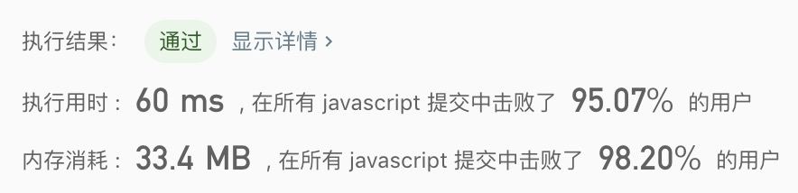

## 有效的括号

> 给定一个只包括 '('，')'，'{'，'}'，'['，']' 的字符串，判断字符串是否有效。<br/>
> 有效字符串需满足：<br/>
> 左括号必须用相同类型的右括号闭合。<br/>
> 左括号必须以正确的顺序闭合。<br/>
> 注意空字符串可被认为是有效字符串。<br/>

示例1:
```text
输入: "()"
输出: true
```

示例2:
```text
输入: "()[]{}"
输出: true
```

示例3:
```text
输入: "(]"
输出: false
```

示例4:
```text
输入: "{[]}"
输出: true
```

- 解法1
  - 解题思路: 
    1. 使用栈的模式，将每个值推进栈中
    2. 比较新值跟栈顶的值是否匹配。如果匹配则出栈
    3. 如果栈中为空，则括号匹配成功；否则失败
    
  - 代码
    ```javascript
    /**
     * @param {string} s
     * @return {boolean}
     */
    const isValid = function(s) {
      if(s.length % 2 === 1 ) return false;
      let stacks = [];
      const matchObj = {
        '(': ')',
        '{': '}',
        '[': ']'
      };
      
      for(let i = 0; i < s.length; i++){
        let stackItem = stacks[stacks.length - 1];
        let curItem = s.charAt(i);
        if(stackItem && matchObj[stackItem] === curItem){
          stacks.pop();
        }else{
          stacks.push(curItem);
        }
      }
      return stacks.length === 0;
    };
    ```
    
    
  - 测试结果
  
  
  - 算法分析
    - 时间复杂度: `O(n)`
    - 空间复杂度: `O(n)`