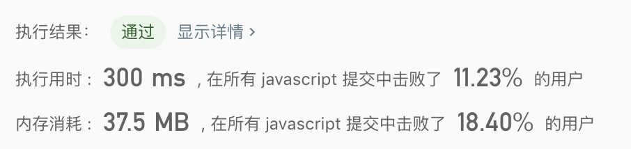

## 删除排序数组中的重复项

> 给定一个排序数组，你需要在原地删除重复出现的元素，使得每个元素只出现一次，返回移除后数组的新长度。 <br/>  
> 不要使用额外的数组空间，你必须在原地修改输入数组并在使用 O(1) 额外空间的条件下完成。

示例1:
```text
给定数组 nums = [1,1,2], 

函数应该返回新的长度 2, 并且原数组 nums 的前两个元素被修改为 1, 2。 
你不需要考虑数组中超出新长度后面的元素。
```

示例2:
```text
给定 nums = [0,0,1,1,1,2,2,3,3,4],

函数应该返回新的长度 5, 并且原数组 nums 的前五个元素被修改为 0, 1, 2, 3, 4。
你不需要考虑数组中超出新长度后面的元素。
```

- 解法1
  - 解题思路:
    1. 要求在在O(1)的空间复杂度内，使用提高时间复杂度的方式处理
    2. 遍历数组，将重复的数据过滤掉
    3. 每次返回过滤后的数组，再遍历一次
    
  - 代码
    ```javascript
    /**
     * @param {number[]} nums
     * @return {number}
     */
    const removeDuplicates = function(nums) {
      for(let i = 0; i < nums.length - 1; i++){
        let temp = nums[i];
        if(temp === nums[i + 1]){
          nums.splice(i, 1);
          i = -1;
        }
      }
      return nums.length; 
    };
    ```
    
  - 测试结果
  
  
  - 算法分析
    - 时间复杂度: `O(n^2)`
    - 空间复杂度: `O(1)`
    
- 总结
  > 时间复杂度太高了。这里需要再优化优化。