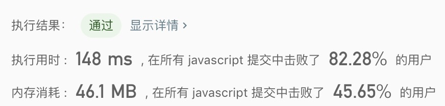

## 字母异位词分组

> 给定一个字符串数组，将字母异位词组合在一起。字母异位词指字母相同，但排列不同的字符串。

示例2:
```text
输入: ["eat", "tea", "tan", "ate", "nat", "bat"],
输出:
[
  ["ate","eat","tea"],
  ["nat","tan"],
  ["bat"]
]
```

- 解法
  - 解题思路:
    1. 通过对象保存key-value
    2. 遍历数组，通过对象保存key-value。key: 排序过的value
      1. 如果value存在该对象中，则直接保存
      2. 如果value不存在该对象中，则创建新数组并保存
    
  - 代码
    ```javascript
    /**
     * @param {string[]} strs
     * @return {string[][]}
     */
    const groupAnagrams = function(strs) {
      const obj = {};
      for(let i = 0; i < strs.length; i++){
        const temp = strs[i].split('').sort().join('');
        if(!obj[temp]){
          obj[temp] = [];
        }
        obj[temp].push(strs[i]);
      }
      return Object.values(obj);
    };
    ```
    
  - 测试结果
  
  
  - 算法分析
    - 时间复杂度: `O(nlogn)`
    - 空间复杂度: `O(n)`