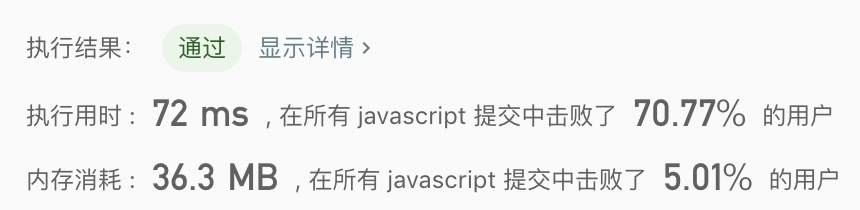

## 最大子序和

> 给定一个整数数组 nums ，找到一个具有最大和的连续子数组（子数组最少包含一个元素），返回其最大和。

示例:
```text
输入: [-2,1,-3,4,-1,2,1,-5,4],
输出: 6
解释: 连续子数组 [4,-1,2,1] 的和最大，为 6。
```

- 解法
  - 解题思路: 动态规划
    1. 通过分析等到方程解：Max(当前值, 该数组上一个值 + 当前数组)
    1. 通过一个数组，记录下当前下标是连续数组的最大值
    2. 数该数组最大的一个值
    
  - 代码
    ```javascript
    /**
     * @param {number[]} nums
     * @return {number}
     */
    const maxSubArray = function(nums) {
      if(nums.length <= 1) return nums.reduce((a, b) => a + b, 0); 
      const arr = [nums[0]];
      for(let i = 1; i< nums.length; i++){
        arr[i] = Math.max(arr[i - 1] + nums[i], nums[i])
      }
      return Math.max(...arr); 
    };
    ```
    
  - 测试结果
  
  
  - 算法分析
    - 时间复杂度: `O(n)`
    - 空间复杂度: `O(n)`