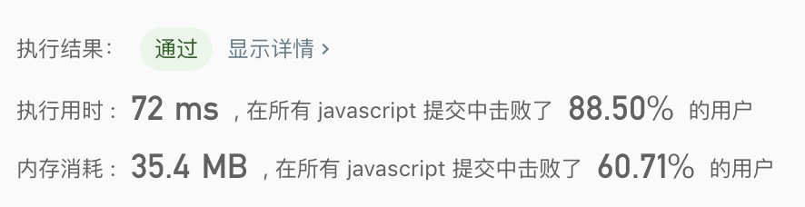

## 旋转链表

> 给定一个链表，旋转链表，将链表每个节点向右移动 k 个位置，其中 k 是非负数。<br/>

示例1:
```text
输入: 1->2->3->4->5->NULL, k = 2
输出: 4->5->1->2->3->NULL
解释:
向右旋转 1 步: 5->1->2->3->4->NULL
向右旋转 2 步: 4->5->1->2->3->NULL
```

示例2:
```text
输入: 0->1->2->NULL, k = 4
输出: 2->0->1->NULL
解释:
向右旋转 1 步: 2->0->1->NULL
向右旋转 2 步: 1->2->0->NULL
向右旋转 3 步: 0->1->2->NULL
向右旋转 4 步: 2->0->1->NULL
```

- 解法
  - 解题思路: 
    1. 通过观察发现，如果k的值为链表长度的倍数，链表回到原点。可得出旋转次数 = k % 链表长度
    2. 通过观察可得链表旋转次数 = 链表后几个数（根据旋转次数切出得到的）+ 剩余的链表数
    
  - 代码
    ```javascript
    /**
     * Definition for singly-linked list.
     * function ListNode(val) {
     *     this.val = val;
     *     this.next = null;
     * }
     */
    /**
     * @param {ListNode} head
     * @param {number} k
     * @return {ListNode}
     */
    const rotateRight = function(head, k) {
      let listLength = 0;
      let headPointer = head;
      while(headPointer){
        listLength++;
        headPointer = headPointer.next;
      }
      let reverseTimes = k % listLength;
      if(listLength <= 1 || reverseTimes === 0) return head;
      
      let postList = new ListNode(0);
      let tempCount = 0;
      let tempPointer = postList;
      headPointer = head;
      while(listLength - reverseTimes > tempCount){
        tempCount++;
        tempPointer.next = new ListNode(headPointer.val);
        tempPointer = tempPointer.next;
        headPointer = headPointer.next;
      }
      
      tempPointer = headPointer;
      while(tempPointer.next){
        tempPointer = tempPointer.next;
      }
      tempPointer.next =  postList.next;
      return headPointer;
    };
    ```
    
  - 测试结果
  
  
  - 算法分析
    - 时间复杂度: `O(n)`
    - 空间复杂度: `O(1)`