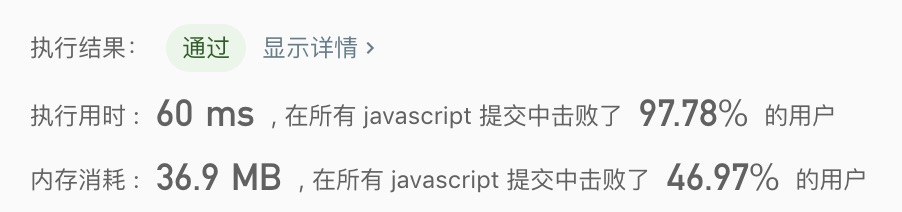

## 最小路径和

> 给定一个包含非负整数的 m x n 网格，请找出一条从左上角到右下角的路径，使得路径上的数字总和为最小。<br/>
> 说明：每次只能向下或者向右移动一步。

示例:
```text
输入:
[
  [1,3,1],
  [1,5,1],
  [4,2,1]
]
输出: 7
解释: 因为路径 1→3→1→1→1 的总和最小。
```

- 解法
  - 解题思路: 动态规划
    1. 用一个二维数组存放经过每个元素路径的的最小的值
    2. 记录方式：
      - 第一排记录：当前元素 + arr[i - 1][j]
      - 第一行记录：当前元素 + arr[i][j - 1]
      - 其他情况：当前元素 + min(arr[i][j - 1], arr[i - 1][j])
    3. 取二维数组的最后一个元素
    
  - 代码
    ```javascript
    /**
     * @param {number[][]} grid
     * @return {number}
     */
    const minPathSum = function(grid) {
      const arr = [];
      let j = 0, i = 0;
      for(i = 0; i < grid.length; i++){
        for(j = 0; j < grid[i].length; j++){
          const subItem = grid[i][j];
          if(!arr[i]){
            arr[i] = [];
          }
          if(i === 0){
            arr[i][j] = j === 0 ? subItem : subItem + arr[i][j - 1];
          }else if(j === 0){
            arr[i][j] = subItem + arr[i - 1][j];
          }else{
            arr[i][j] = subItem + Math.min(arr[i][j - 1], arr[i - 1][j]);
          }
        }
      }
      return arr[i - 1][j - 1];
    };
    ```
    
  - 测试结果
  
  
  - 算法分析
    - 时间复杂度: `O(n^2)`
    - 空间复杂度: `O(n)`