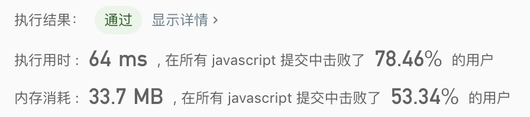

## 加一

> 给定一个由整数组成的非空数组所表示的非负整数，在该数的基础上加一。<br/>
> 最高位数字存放在数组的首位， 数组中每个元素只存储单个数字。<br/>
> 你可以假设除了整数 0 之外，这个整数不会以零开头。

示例1
```text
输入: [1,2,3]
输出: [1,2,4]
解释: 输入数组表示数字 123。
```

示例2
```text
输入: [4,3,2,1]
输出: [4,3,2,2]
解释: 输入数组表示数字 4321。
```

- 解法
  - 解题思路: 
    1. 将数组最后一个元素加1
    2. 倒序遍历数组的每个元素，如果大于等于10。则digits[i]= 当前元素 - 10，digits[i - 1] = digits[i - 1] + Math.floor(当前元素 / 10)
    
  - 代码
    ```javascript
    /**
     * @param {number[]} digits
     * @return {number[]}
     */
    const plusOne = function(digits) {
      const l = digits.length;
      digits[l - 1] = digits[l - 1] + 1;
      for(let i = digits.length - 1; i > 0; i--){
        const item = digits[i];
        if(item >= 10){
          digits[i] = item - 10;
          digits[i - 1] = digits[i - 1] + Math.floor(item / 10);
        }
      }
      if(digits[0] >= 10){
        digits[0] = digits[0] - 10;
        digits.unshift(1);
      }
      return digits;
    };
    ```
    
  - 测试结果
  
  
  - 算法分析
    - 时间复杂度: `O(n)`
    - 空间复杂度: `O(1)`