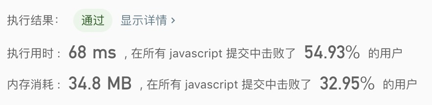

## 搜索二维矩阵

> 编写一个高效的算法来判断 m x n 矩阵中，是否存在一个目标值。该矩阵具有如下特性：<br/>
> 每行中的整数从左到右按升序排列。<br/>
> 每行的第一个整数大于前一行的最后一个整数。

示例1:
```text
输入:
matrix = [
  [1,   3,  5,  7],
  [10, 11, 16, 20],
  [23, 30, 34, 50]
]
target = 3
输出: true
```

示例2:
```text
输入:
matrix = [
  [1,   3,  5,  7],
  [10, 11, 16, 20],
  [23, 30, 34, 50]
]
target = 13
输出: false
```

- 解法一
  - 解题思路: 暴力枚举
    
  - 代码
    ```javascript
    /**
     * @param {number[][]} matrix
     * @param {number} target
     * @return {boolean}
     */
    const searchMatrix = function(matrix, target) {
      for(let i = 0; i < matrix.length; i++){
        if(matrix[i].includes(target)){
          return true;
        }
      }
      return false;
    };
    ```
    
  - 测试结果
  
  
  - 算法分析
    - 时间复杂度: `O(n)`
    - 空间复杂度: `O(1)`
    
- 解法二
  - 解题思路: 
    1. 将二维数组转成一维数组
    2. 通过二分法查找一维数组是否存在所需要的值
    
  - 代码
    ```javascript
    /**
     * @param {number[][]} matrix
     * @param {number} target
     * @return {boolean}
     */
    const searchMatrix = function(matrix, target) {
      const store = matrix.reduce((pre, cur) => pre.concat(cur), []);
      let left = 0;
      let right = store.length - 1;
      while(left <= right){
        let mid = Math.floor((left + right) / 2);
        if(store[mid] > target){
          right = mid - 1;
        }else if(store[mid] < target){
          left = mid + 1;
        }else{
          return true;
        }
      }
      return false;
    };
    ```
    
  - 测试结果
  
  
  - 算法分析
    - 时间复杂度: `O(nlogN)`
    - 空间复杂度: `O(n^2)`