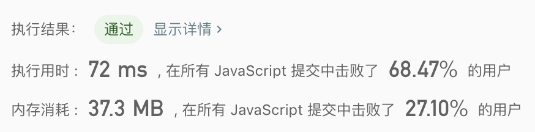

## 只出现一次的数字

> 给定一个非空整数数组，除了某个元素只出现一次以外，其余每个元素均出现两次。<br/>
> 找出那个只出现了一次的元素。

示例1: 
```text
输入: [2,2,1]
输出: 1
```

示例2: 
```text
输入: [4,1,2,1,2]
输出: 4
```

- 解法
  - 解题思路: 
    1. 使用哈希表对元素进行增加以及删除操作
    2. 当该哈希存在这个元素进行删除，否则将值添加到哈希表中
    3. 此时哈希只有一个值，输出该值
    
  - 代码
    ```javascript
    /**
     * @param {number[]} nums
     * @return {number}
     */
    const singleNumber = function(nums) {
      const store = {};
      for(let i = 0; i < nums.length; i++){
        if(typeof store[nums[i]] === 'undefined'){
          store[nums[i]] = nums[i];
        }else{
          delete store[nums[i]];
        }
      }
      return +Object.keys(store)[0];
    };
    ```
    
  - 测试结果
  
  
  - 算法分析
    - 时间复杂度: `O(n)`
    - 空间复杂度: `O(n)`