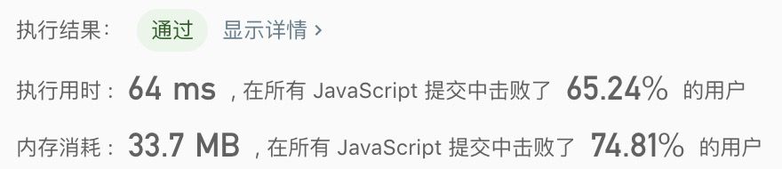

## 二叉树的后序遍历

> 给定一个二叉树，返回它的*后序*遍历。

示例1: 
```text
输入: [1,null,2,3]  
   1
    \
     2
    /
   3 

输出: [3,2,1]
```

- 解法
  - 解题思路: 递归
    
  - 代码
    ```javascript
    /**
     * Definition for a binary tree node.
     * function TreeNode(val) {
     *     this.val = val;
     *     this.left = this.right = null;
     * }
     */
    /**
     * @param {TreeNode} root
     * @return {number[]}
     */
    const postorderTraversal = function(root) {
      const result = [];
      if(!root) return result;
      
      const loop = (root) => {
        root.left && loop(root.left);
        root.right && loop(root.right);
        result.push(root.val);
      };
      loop(root);
      return result;
    };
    ```
    
  - 测试结果
  
  
  - 算法分析
    - 时间复杂度: `O(n)`
    - 空间复杂度: `O(n)`